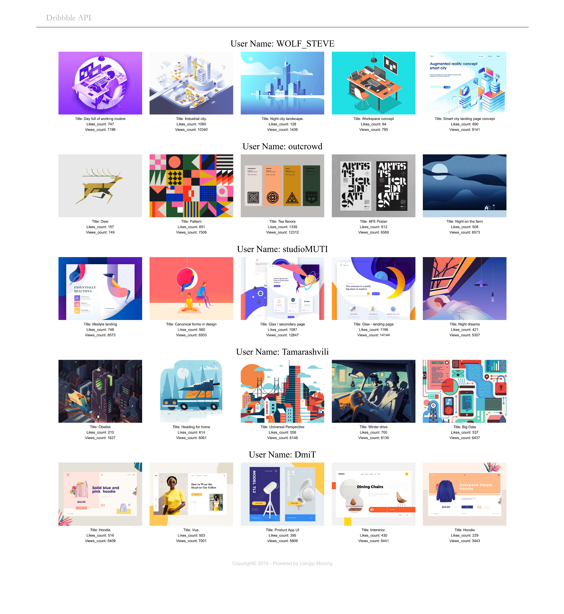
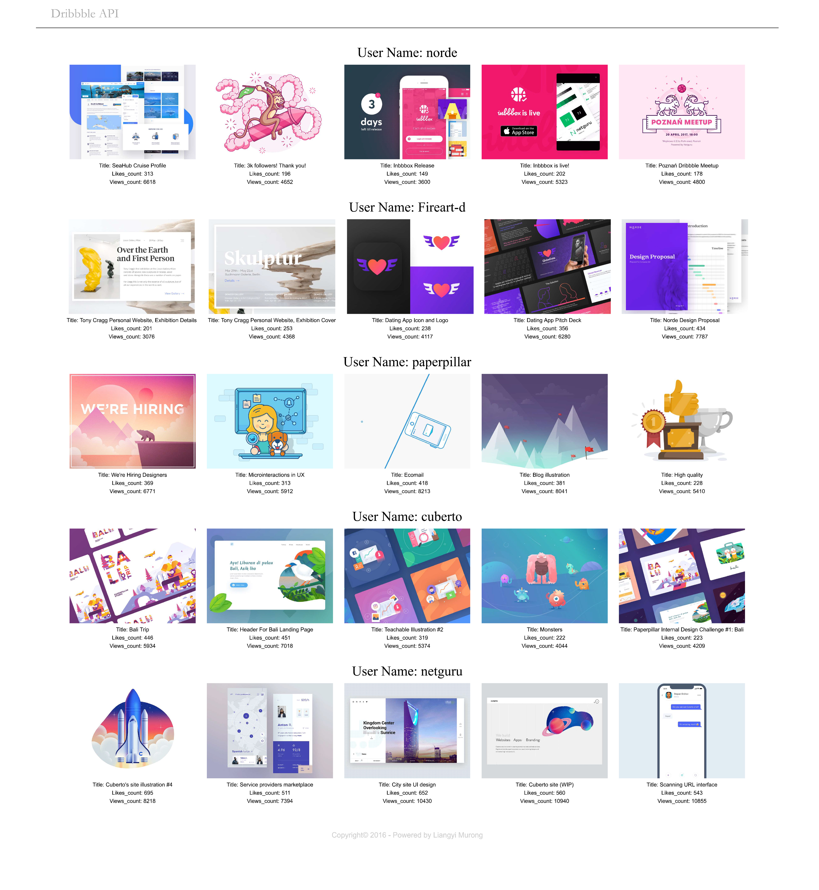

# Oauth2 API

### Title: Top posts extraction from Dribbble

## Basics

I have provided here a few files:

* This README
* A code file, `SI507F17_finalproject.py`
* A file with tests, `SI507F17_finalproject_tests.py`
* Some cache files I created using the code file
* Two pdf files to show what the page should look like when running the server
* Two credential files to access the API and Database(Only used for review of instructors, will be changed or will be after the review.)
* A requirements file to indicate what libraries should be installed to run the codes

## Instructions

Type **python SI507F17_finalproject.py** in your bash to run the main code, and **python SI507F17_finalproject_tests.py** to run the test code.

Create a database named **507final** for the code to run.

Use the command **pip install -r requirements.txt** to install all the libraries needed to run the code.

Go to **http://developer.dribbble.com/** and register an application and get the client_key and client_secret for yourself.

## Run the code

After running the code, you will get connection to your database, and create two tables(Users, Shots).
The table Users is used to stored the name of the users I gathered data from and the table Shots is used to stored the title, shot url, likes count, views count, and created time of each shot.

Extract 12 shots from each user and look into the ratio of likes count and views count, to find out which shots are most 'successful' among all the shots.

Ouath2 was used to get raw data from dribbble API, and use the method **get_sorted_dict_list** to get the list of the shot dictionary containing the data we want to put into the database.

I used the class Shots to processed the data and insert the data into each table.

Finally, I used the flask library to visualize my data, so that people can use the local server to see it.

## Expected result

Running the code on the bash, people can open their broswers and go to **localhost:5000/dribbble** to see the page for visualization.

